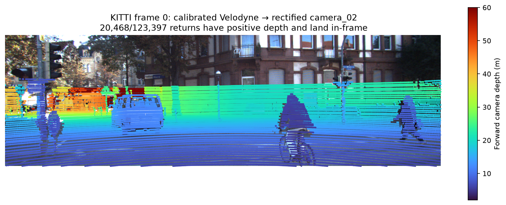
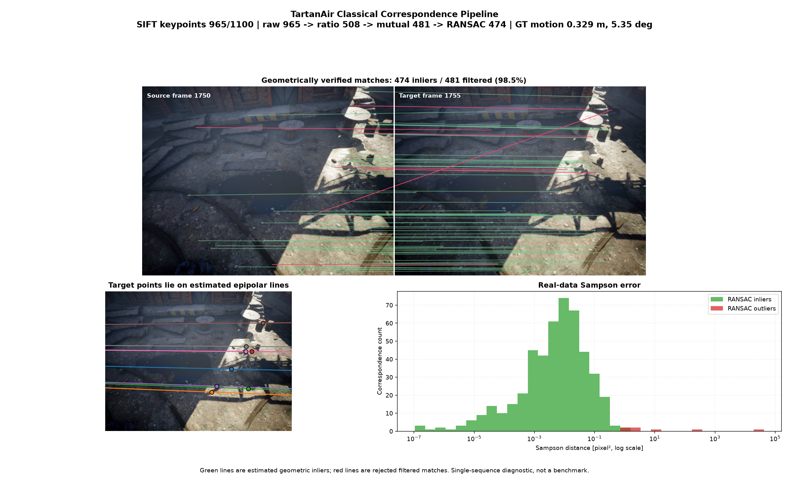
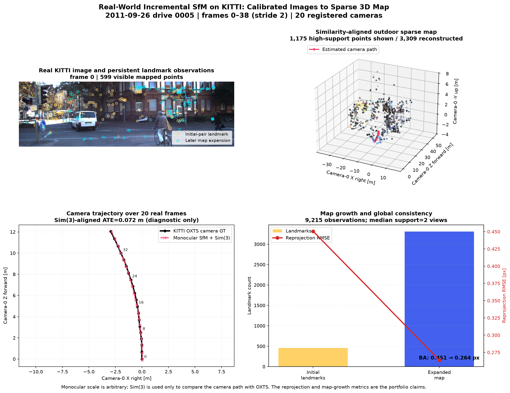
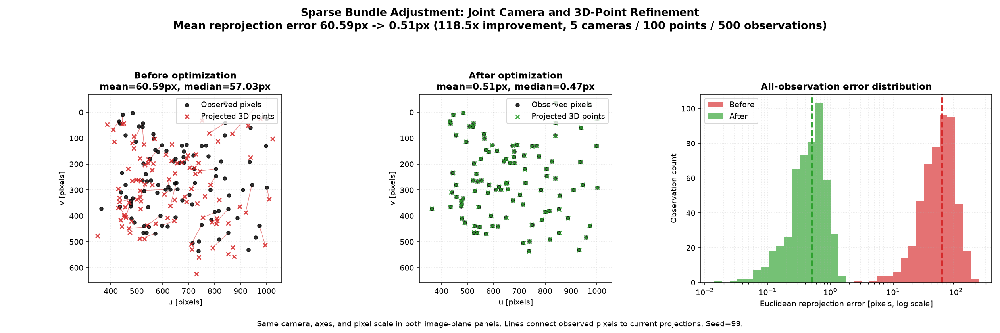
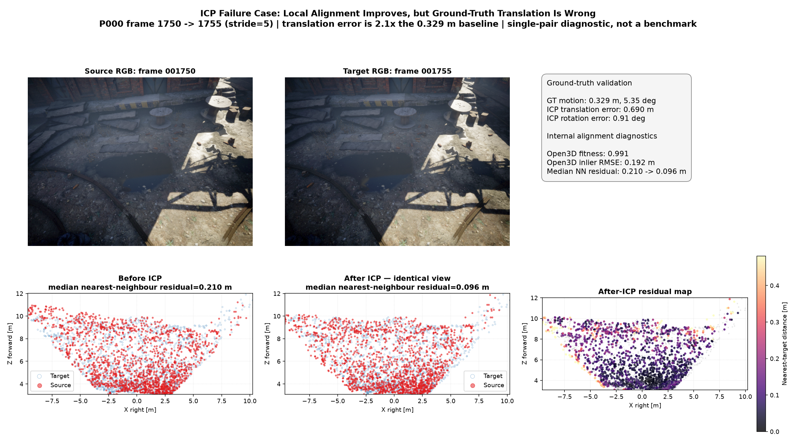
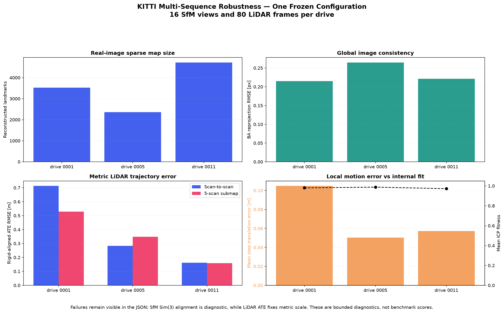

# SpatialWM

> A geometry-first multi-sensor 3D perception project that recovers motion and structure
> from images, RGB-D, and LiDAR, then turns the estimates into auditable trajectories and maps.

This README documents the portfolio-grade classical perception pipeline on `main`.

## What the project is trying to answer

How do calibrated sensor samples become defensible 3D structure, ego-motion, trajectories,
and maps while keeping transform direction, scale, confidence, and failure modes explicit?

## The complete 3D story

```text
                       ┌─ matches → F/E RANSAC → pose → triangulation
sensor manifests ──────┤                                ↓
timestamps + frames    │                         incremental SfM → BA
calibration + poses    │                                ↓
                       ├─ RGB + depth → metric cloud → ICP → GT SE(3) error
                       │
                       └─ camera + Velodyne + OXTS
                              ├─ LiDAR→image calibration check
                              └─ scan-to-scan / submap odometry → ATE/RPE → BEV
```

Read [the stage-by-stage 3D vision story](docs/3d_vision_story.md) for the intuition,
coordinate contracts, failure modes, and completion checks.

## Results snapshot

| Capability | Bounded evidence |
|---|---|
| Sensor calibration | 20,468 / 123,397 Velodyne returns project into KITTI frame 0 and follow image structure |
| Real-world sparse SfM hero | 20/20 registered views, 3,309 landmarks, 0.264 px BA reprojection RMSE |
| Frozen three-drive SfM suite | 48/48 registered views, 0.221 px median BA reprojection RMSE |
| KITTI LiDAR odometry hero | 0.318 m rigid-aligned ATE over 100 frames, metric scale fixed |
| Frozen three-drive LiDAR suite | 0.283 m median rigid-aligned ATE over 80 frames per drive |
| BEV mapping | 9.66 million accumulated cropped returns at 0.10 m cell size |

The hero numbers retain the most interpretable single-sequence visuals. The multi-sequence
suite applies one configuration without per-drive tuning and exposes both median and worst-case
behavior. Neither is presented as a KITTI benchmark submission.

## Verified evidence

### 1. Synchronized sensor ingestion and calibration

TartanAir RGB/depth/poses and KITTI camera/Velodyne/OXTS are normalized into validated sensor
records with timestamps, named coordinate frames, calibration edges, and provenance. KITTI
frame 0 projects 20,468 of 123,397 Velodyne returns into the rectified camera image; the
depth-coloured points visibly follow scene structure.



See [sensor ingestion and calibration](docs/sensor_ingestion.md).

### 2. Robust image geometry

The classical SIFT pipeline applies ratio and mutual filtering before fundamental-matrix
RANSAC. On TartanAir frames 1750 and 1755, 474 of 481 symmetric matches are geometric inliers
(98.5%). A separate deterministic diagnostic with 25% injected outliers recovers the known
consensus at 99.2% precision and 100% recall.



### 3. Incremental sparse SfM

The transparent SfM integration connects matching, F/E recovery, cheirality, triangulation,
PnP registration, landmark expansion, and bundle adjustment. On 20 real KITTI camera frames
sampled from raw drive 0005, it registers all 20 views, grows from 456 initial landmarks to
**3,309 landmarks**, records 9,215 observations, and reduces reprojection RMSE from 0.451 px
to **0.264 px**.



The figure connects image observations, map expansion, the coloured outdoor point cloud, and
the camera path. The monocular trajectory is Sim(3)-aligned only as a diagnostic; its aligned
ATE is not a metric-scale portfolio claim. TartanAir remains a controlled RGB-D and SfM
regression dataset. See [incremental sparse SfM](docs/sparse_sfm.md).

### 4. Bundle adjustment and RGB-D registration

On a deterministic 5-camera/100-point problem, sparse gauge-fixed BA reduces mean
reprojection error from 60.59 px to 0.51 px (118.5x).



Synthetic ICP recovers a known 0.295 m / 5.4° transform with 0.0004 m translation and 0.006°
rotation error. The real TartanAir case is intentionally retained as a failure: Open3D reports
0.991 fitness, yet translation error is 0.690 m. Local overlap is not ground-truth accuracy.



### 5. KITTI LiDAR odometry and BEV mapping

On 100 synchronized KITTI raw frames, the primary scan-to-scan trajectory achieves:

- **0.318 m** rigid-aligned ATE RMSE with scale fixed;
- **1.264 m** raw endpoint error;
- **0.049 m / 0.098°** mean one-step translation/rotation error.

A five-scan submap improves local translation error to 0.036 m and ICP inlier RMSE from 0.197
m to 0.158 m, but worsens global ATE to 0.485 m. It is documented as a sensitivity result,
not advertised as an improvement.


The same primary poses transform 9.66 million cropped returns into a fixed-axis 0.10 m
bird's-eye-view return-density map.


See [LiDAR odometry, local submaps, and BEV](docs/lidar_odometry_bev.md).

### 6. Frozen multi-sequence robustness

The same settings were applied to KITTI raw drives 0001, 0005, and 0011: 16 monocular views
and 80 LiDAR frames per drive. All 48 requested SfM views register successfully. Median SfM
reprojection RMSE is **0.221 px**, while median rigid-aligned scan-to-scan LiDAR ATE is
**0.283 m**. The worst LiDAR ATE is 0.713 m on drive 0001, which is retained rather than
hidden by reporting only the best drive.

The five-scan submap improves ATE on two of three drives but worsens it on drive 0005. This
supports the narrower conclusion that submaps change the local/global error tradeoff; they are
not a universally better estimator.



See [the multi-sequence evaluation protocol and interpretation](docs/kitti_multisequence_evaluation.md).

## Reproduce

```bash
uv sync --extra dev
uv run pytest -q
uv run ruff check src tests scripts
```

Download and validate the bounded KITTI slice:

```bash
uv run python scripts/download_kitti_slice.py \
  --drive 0005 --frames 100 --output-dir data/raw/kitti --max-gb 1.0 --download
uv run python scripts/build_sensor_manifest.py \
  --frames 100 --output-dir data/processed/manifests
```

Generate the real-world camera reconstruction and evaluate LiDAR odometry/BEV:

```bash
uv run python scripts/evaluate_kitti_sfm.py \
  --kitti-root data/raw/kitti \
  --start 0 --stride 2 --frames 20 \
  --output-dir figures/curated
uv run python scripts/evaluate_kitti_lidar.py \
  --kitti-root data/raw/kitti --frames 100 --output-dir figures/curated
```

Run the frozen three-drive robustness suite:

```bash
uv run python scripts/download_kitti_slice.py \
  --drive 0001 --frames 80 --output-dir data/raw/kitti --max-gb 0.5 --download
uv run python scripts/download_kitti_slice.py \
  --drive 0011 --frames 80 --output-dir data/raw/kitti --max-gb 1.0 --download
uv run python scripts/evaluate_kitti_suite.py \
  --drives 0001 0005 0011 \
  --sfm-views 16 --sfm-stride 2 --lidar-frames 80 \
  --runs-dir data/processed/kitti_multisequence \
  --output-dir figures/curated
```

Raw data and generated manifests are not committed. Curated figures, JSON metrics, and compact
NPZ reconstructions are versioned.

## Honest limitations

- This is an offline, bounded pipeline, not production streaming infrastructure.
- SfM uses classical local tracks without loop closure, relocalization, or COLMAP-scale track
  management.
- ICP is point-to-point and does not remove dynamic objects.
- LiDAR odometry has no global pose graph or loop closure.
- GPS/IMU is validation ground truth, not a fused navigation estimator.
- No novelty, state-of-the-art, or benchmark-leader claim is made.

The implementation uses mature OpenCV, Open3D, SciPy, NumPy, and pykitti components with
repository-specific orchestration, transform contracts, tests, metrics, and inspected
visuals. It is not described as “from scratch.”

## Documentation

- [Complete 3D vision story](docs/3d_vision_story.md)
- [Sensor ingestion and calibration](docs/sensor_ingestion.md)
- [Feature matching](docs/feature_matching.md)
- [Two-view geometry](docs/two_view_geometry.md)
- [RANSAC](docs/ransac.md)
- [Incremental sparse SfM](docs/sparse_sfm.md)
- [Bundle adjustment](docs/bundle_adjust.md)
- [ICP](docs/icp.md)
- [TartanAir registration](docs/tartanair_registration.md)
- [KITTI LiDAR odometry and BEV](docs/lidar_odometry_bev.md)
- [KITTI multi-sequence robustness](docs/kitti_multisequence_evaluation.md)
