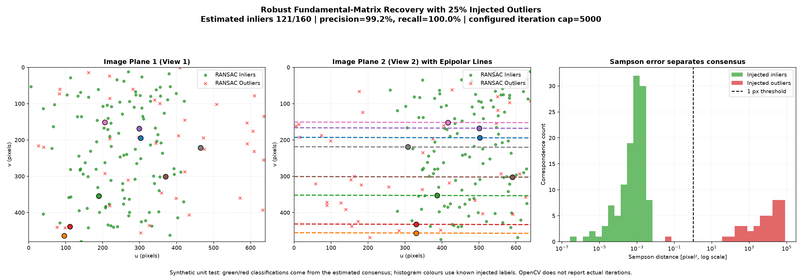
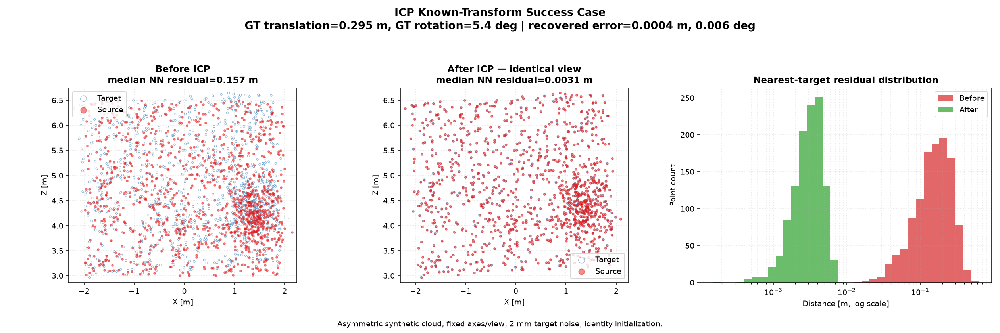

# SpatialWM

> A geometry-first 3D computer-vision project that recovers motion and structure from images, RGB-D, and LiDAR, then tests whether the quality of that geometry changes future visual prediction.

**Current status:** the camera, classical SIFT/ORB matching, two-view RANSAC, sparse bundle adjustment, ICP, TartanAir registration, KITTI LiDAR odometry, trajectory evaluation, and BEV foundations work. End-to-end sparse SfM is the active missing classical integration. The world-model experiment is deliberately gated until the classical 3D story is complete.

## The question

SpatialWM asks:

> When does explicit ego-motion help predict the visual future, and how does that benefit change when the motion estimate becomes noisy or unreliable?

Answering that credibly requires more than attaching a pose vector to a neural network. The project first builds and validates the geometry that produces camera motion, 3D structure, trajectory error, and confidence signals.

## The 3D story

```text
images  → matches → robust F/E → relative pose → triangulation → bundle adjustment → sparse SfM
RGB-D   → metric point clouds → ICP → ground-truth SE(3) error
LiDAR   → scan registration → accumulated trajectory → ATE/RPE + BEV
all geometry paths → pose and reliability → future-latent prediction
```

Read [The SpatialWM 3D Vision Story](docs/3d_vision_story.md) for an intuitive stage-by-stage explanation, implementation map, failure modes, and numerical/visual completion gates.

## Active scope

### 1. Classical images to sparse 3D

- calibrated projection, unprojection, and coordinate frames;
- classical feature extraction and filtered correspondence;
- robust fundamental/essential matrix estimation;
- relative pose, cheirality, and DLT triangulation;
- sparse bundle adjustment;
- one controlled multi-view reconstruction with reprojection evaluation.

### 2. RGB-D and LiDAR motion

- RGB-D point-cloud creation and ICP;
- ground-truth transform validation on TartanAir;
- KITTI LiDAR scan-to-scan odometry;
- Umeyama alignment, ATE/RPE, and BEV occupancy;
- explicit success and failure/sensitivity evidence.

### 3. Gated world-model research extension

The minimal experiment compares:

| Model | Motion input | Purpose |
|---|---|---|
| B1 | none | Action-free latent-prediction baseline |
| T-GT | ground-truth relative pose | Tests whether ideal geometry contains useful signal |
| T-EST | classically estimated pose | Tests whether the benefit survives realistic estimation error |
| T-NOISE | controlled pose corruption | Finds where geometry stops helping or starts hurting |
| T-GATED | estimated pose plus confidence, optional | Tests whether reliability-aware conditioning recovers the benefit |

B1 versus T-GT runs first on a small fixed clip set. T-EST/T-NOISE/T-GATED are only justified if that GO/NO-GO experiment shows a stable signal. Results will be separated by ego-motion magnitude and prediction horizon, not reported only as one aggregate loss.

## Current evidence

The current focused geometry stack has 116 passing tests. The complete collection is clean at 116 passed, 70 explicitly skipped, and no failures; deferred placeholder contracts remain visible as skips rather than being misreported as active regressions.

### Robust two-view correspondences

The synthetic RANSAC diagnostic injects 25% known outliers and recovers the consensus with 99.2% precision and 100% recall. The figure now distinguishes the configured OpenCV iteration cap from an unavailable actual-iteration count and shows the Sampson-error separation.



On TartanAir P000 frames 1750 to 1755, the reusable SIFT pipeline produces:

- 965/1100 detected keypoints;
- 508 ratio-filtered matches;
- 481 symmetric matches;
- 474 fundamental-matrix inliers, a 98.5% geometric inlier ratio;
- ground-truth camera motion of 0.329 m and 5.35 degrees.


See [the feature-matching reference](docs/feature_matching.md).

### Sparse bundle adjustment

On a deterministic 5-camera/100-point/500-observation problem, sparse gauge-fixed bundle adjustment reduces:

- mean reprojection error from 60.59 px to 0.51 px;
- median reprojection error from 57.03 px to 0.47 px;
- mean error by 118.5x overall.


The before/after panels use the same camera, axes, and scale. See [the bundle-adjustment reference](docs/bundle_adjust.md) for the parameterization, sparsity, gauge choice, failure modes, and interpretation.

### ICP success and real-data failure

On an asymmetric synthetic cloud with a known transform, ICP recovers a 0.295 m / 5.4-degree motion with 0.0004 m translation error and 0.006-degree rotation error.



The TartanAir diagnostic is intentionally shown as a failure case. Local alignment improves and Open3D reports 0.991 fitness, but translation error is 0.690 m—2.1 times the 0.329 m ground-truth baseline. This demonstrates why fitness/RMSE and visual overlap cannot replace ground-truth SE(3) validation.


### KITTI LiDAR odometry

A bounded 10-frame KITTI raw diagnostic on 2011-09-26 drive 0005 reproduced:

- ATE RMSE: `0.048072 m`
- mean one-step RPE: `0.061191 m`

These values validate a short local pipeline. They are not full-sequence KITTI benchmark claims.

TartanAir RGB-D loading and trajectory preview remain dataset-introduction diagnostics rather than algorithmic results.

## Reproduce the current diagnostics

Install and verify:

```bash
uv sync --extra dev
uv run pytest -q \
  tests/test_bundle_adjust.py \
  tests/test_features.py \
  tests/test_camera.py tests/test_two_view.py tests/test_ransac.py \
  tests/test_icp.py tests/test_tartanair.py tests/test_lidar_io.py \
  tests/test_lidar_odometry.py tests/test_trajectory.py \
  tests/test_voxelize.py tests/test_utils.py tests/test_evaluate_kitti_lidar.py
uv run ruff check src tests scripts
```

Generate the existing geometry/data diagnostics:

```bash
uv run python scripts/make_figures.py \
  --figures geometry-ransac geometry-icp bundle-adjust \
  --output-dir figures/curated
uv run python scripts/make_figures.py \
  --figures tartanair-rgbd tartanair-matches tartanair-icp \
  --output-dir figures/curated \
  --tartanair-frame 1750 \
  --tartanair-stride 5
```

Evaluate TartanAir RGB-D registration:

```bash
uv run python scripts/evaluate_tartanair_icp.py --output-dir /tmp/spatialwm-registration
```

Evaluate the bounded KITTI LiDAR sequence:

```bash
uv run python scripts/evaluate_kitti_lidar.py \
  --kitti-root data/raw/kitti \
  --frames 10 \
  --output-dir /tmp/spatialwm-kitti
```

Raw data is not committed. The pinned initial TartanAir sequence is `abandonedfactory/Easy/P000`; the current KITTI diagnostic uses 2011-09-26 drive 0005.

## Completion checkpoints

The project advances in this order:

1. **Bundle adjustment:** numerical and visual engineering gate complete; human whiteboard signoff remains.
2. **Reusable matching:** numerical, real-data, and visual gate complete.
3. **Minimal SfM:** recognizable controlled-scene cloud, valid camera path, and target final reprojection error below 2 px.
4. **RGB-D evidence:** synthetic success and ground-truth-validated real failure are documented.
5. **LiDAR evidence:** curated estimated-versus-GT trajectory, ATE/RPE, BEV, and drift explanation.
6. **Portfolio closeout:** tracked curated artifacts, reproducible commands, clean documentation, and practical CI.
7. **World-model GO/NO-GO:** B1 versus T-GT on a small seeded clip set.
8. **Geometry-quality study:** estimated/noisy/confidence-aware pose only after a GO.

See [PROGRESS.md](PROGRESS.md) for the exact current checkpoint and [CLAUDE.md](CLAUDE.md) for scope and acceptance rules.

## Deferred scope

The repository contains scaffolding for experiments that are not part of the active deliverable:

- PointNet/SemanticKITTI segmentation;
- elevation products such as DSM/DTM/nDSM;
- ScanNet, HM3D, nuScenes, and extra dataset expansion;
- Habitat/CEM/MPC planning;
- multiple SLAM or reconstruction wrappers;
- large JEPA variants and broad conditioning sweeps.

These files are retained as possible future work, not presented as completed capabilities.

## Implementation and attribution

- `geometry/camera.py` is the human-written core.
- Advanced geometry uses mature OpenCV, Open3D, and SciPy components with repository-specific integration, tests, diagnostics, and human review.
- A frozen pretrained visual encoder will be used for the later latent-prediction experiment.

The project makes no novelty, state-of-the-art, or completed research-paper claim. The research ambition is a controlled analysis of **when geometry quality makes explicit motion conditioning useful**.

## Documentation

- [3D vision story and checkpoints](docs/3d_vision_story.md)
- [Bundle adjustment](docs/bundle_adjust.md)
- [Classical feature matching](docs/feature_matching.md)
- [Two-view geometry](docs/two_view_geometry.md)
- [RANSAC](docs/ransac.md)
- [ICP](docs/icp.md)
- [TartanAir registration](docs/tartanair_registration.md)
- [Design decisions](docs/decisions.md)
