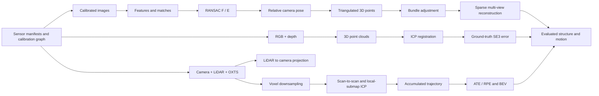

# The SpatialWM 3D Vision Story

## Pixels to motion, structure, and mapping

SpatialWM is easiest to understand as one question asked at increasing levels of difficulty:

> From what a moving camera or LiDAR sees, can we recover how the observer moved, reconstruct
> stable 3D structure, and quantify when the resulting trajectory or map should be trusted?

The project connects classical geometry modules into an evaluated perception pipeline rather
than treating feature matching, registration, and mapping as isolated demonstrations.

## The complete story at a glance

There are two connected estimator threads built on one sensor contract:

1. **Images to sparse 3D:** infer correspondences, camera motion, and scene points.
2. **Depth/LiDAR to motion:** align measured 3D point clouds and accumulate a trajectory.

## Status map

| Stage | Core question | Repository component | Status |
|---|---|---|---|
| 0. Ingestion, frames, calibration | What sensor, time, and coordinate frame is each number in? | `data/sensors.py`, `geometry/camera.py` | Working on TartanAir and KITTI |
| 1. Correspondences | Which pixels describe the same physical point? | `geometry/features.py`, OpenCV matcher | Working on synthetic, TartanAir, and real KITTI data |
| 2. Robust two-view geometry | What camera motion explains the matches? | `geometry/ransac.py`, `geometry/two_view.py` | Working |
| 3. Triangulation | Where is the matched point in 3D? | `geometry/two_view.py` | Unit-tested and integrated into real KITTI SfM |
| 4. Bundle adjustment | Which cameras and points best explain all images jointly? | `geometry/bundle_adjust.py` | Unit-tested and integrated into real KITTI SfM |
| 5. Sparse SfM | Can the stages reconstruct and expand real scenes? | `geometry/sfm_toy.py` | Real KITTI hero plus frozen three-drive gate complete; TartanAir retained as controlled regression |
| 6. RGB-D registration | Can direct depth recover relative motion? | `geometry/icp.py`, `geometry/tartanair.py` | Synthetic success and real failure are visually/quantitatively documented |
| 7. LiDAR odometry and BEV | Can repeated 3D scans form a trajectory and map view? | `geometry/lidar_odometry.py`, `eval/trajectory.py`, `perception/voxelize.py` | Inspected 100-frame hero plus frozen three-drive gate complete |

---

## Stage 0 — Camera model, calibration, and frames

### The question

Before estimating motion, what does a 3D point mean and how does it become a pixel?

### Intuition

A camera performs two transformations:

1. **Extrinsics** move a world point into the camera frame:
   `X_cam = R X_world + t`.
2. **Intrinsics** convert that camera-frame direction into pixel coordinates:
   `x ~ K X_cam`.

After dividing by depth, the result is `(u, v)`. With a depth value, the process can be reversed:
`X_cam = depth * K^-1 [u, v, 1]^T`.

The dangerous detail is transform direction. A matrix that maps world to camera is not interchangeable with a camera-to-world pose. For world-to-camera `R, t`, the camera centre in world coordinates is `C = -R^T t`.

### Repository implementation

- `project(K, R, t, X)` in `geometry/camera.py`
- `unproject(K, uv, depth)`
- `transform_points(T, X)`
- `camera_center(R, t)`
- `parse_pose_to_transform(...)` and `derive_relative_transform(...)` in `geometry/tartanair.py`
- `SensorFrame`, `SensorSequence`, and dataset adapters in `data/sensors.py`
- a named KITTI `Velodyne → camera_02` calibration edge and projection check

TartanAir poses are treated as camera-to-world poses after conversion to the documented OpenCV RDF camera convention. A source-to-target point transform is:

`T_source_to_target = inverse(T_target_to_world) @ T_source_to_world`.

### Proof that this stage is done

- projection/unprojection round-trip passes numerically;
- identity and known SE(3) transforms act as expected;
- camera centre is checked against `-R^T t`;
- transform direction is written in captions and variable names.

### Common failures

- confusing camera-to-world with world-to-camera;
- using metres in one path and another scale elsewhere;
- incorrect quaternion ordering;
- multiplying transforms in the wrong order;
- projecting points behind the camera.

Read: [Sensor ingestion](sensor_ingestion.md), [Two-view geometry](two_view_geometry.md), and [TartanAir registration](tartanair_registration.md).

---

## Stage 1 — Feature extraction and correspondence

### The question

Which location in image 1 represents the same physical scene point in image 2?

### Intuition

Motion cannot be recovered from two images until the algorithm establishes candidate correspondences. A classical pipeline:

1. detects repeatable keypoints such as corners or blobs;
2. describes the local appearance around each keypoint;
3. finds nearby descriptors in the other image;
4. rejects ambiguous matches with a nearest-neighbour ratio test;
5. optionally requires a mutual match;
6. lets geometric verification reject the remaining outliers.

The appearance matcher proposes “these might be the same point.” RANSAC later asks “can one camera-motion geometry explain many of these proposals?”

### Repository target

`geometry/features.py` wraps a focused OpenCV SIFT or ORB pipeline. It returns keypoint
coordinates, descriptor matches, and enough bookkeeping to distinguish:

- raw descriptor matches;
- matches after ratio/mutual filtering;
- geometric inliers after RANSAC.

The existing `tartanair_feature_matches.png` is a useful diagnostic, but an image artifact alone is not a reusable implementation contract.

### Proof that this stage is done

- deterministic test on a transformed synthetic image;
- real TartanAir pair with raw, filtered, and inlier counts;
- visual uses different colours for accepted/rejected or inlier/outlier matches;
- failure case demonstrates blur, repeated texture, illumination change, or insufficient overlap.

### Common failures

- repeated texture produces convincing but wrong matches;
- a ratio threshold that is too loose leaves many outliers;
- a threshold that is too strict removes useful geometry;
- pure rotation or tiny baseline gives matches but weak depth;
- dynamic objects violate the static-scene model.

Read: [Classical feature matching](feature_matching.md).

---

## Stage 2 — Robust two-view geometry

### The question

Given noisy correspondences, what relative camera motion is consistent with the static scene?

### Intuition

For corresponding homogeneous image points `x1` and `x2`, the fundamental matrix satisfies:

`x2^T F x1 = 0`.

This means the point in image 2 should lie on the epipolar line induced by the point in image 1. The normalized eight-point algorithm estimates `F`, but ordinary least squares is easily corrupted by bad matches. RANSAC repeatedly proposes a model from a minimal sample and keeps the model supported by the largest geometrically consistent set.

With known camera intrinsics:

`E = K2^T F K1`.

Decomposing `E` yields four possible rotation/translation-direction pairs. Cheirality selects the pair for which triangulated points lie in front of both cameras.

Important limitation: monocular two-view geometry recovers translation **direction**, not metric scale.

### Repository implementation

- `fundamental_ransac(x1, x2, ...)` in `geometry/ransac.py`
- `normalize_points(...)`, `fundamental_8pt(...)`, `essential_from_F(...)`
- `decompose_E(...)`, `cheirality_select(...)`
- `sampson_distance(...)` in `geometry/two_view.py`

OpenCV supplies the production-grade robust estimator; repository code standardizes its inputs, outputs, and diagnostics. The conceptual value is understanding normalization, thresholds, degeneracy, and pose ambiguity.

### Proof that this stage is done

- synthetic recovery of known rotation and translation direction;
- robustness test with a substantial outlier fraction;
- epipolar overlay and inlier/outlier correspondence visual;
- rotation error, translation-direction error, Sampson error, and inlier ratio reported.

### Common failures

- planar scenes and pure rotation create degeneracy;
- too little baseline makes translation/depth unstable;
- wrong intrinsics corrupt `E`;
- RANSAC pixel threshold is inconsistent with image resolution/noise;
- moving objects dominate the inlier set.

Read: [RANSAC](ransac.md) and [Two-view geometry](two_view_geometry.md).

---

## Stage 3 — Triangulation

### The question

Once camera poses and pixel correspondences are known, where is each scene point in 3D?

### Intuition

Each pixel defines a ray leaving a camera centre. In ideal data, the two rays from a matched point intersect. Real rays are skew because pixels and poses are noisy, so triangulation finds the 3D point whose projections best satisfy the two camera equations.

DLT triangulation solves a homogeneous linear system constructed from two projection matrices and the two image observations. It gives an initial 3D estimate; it does not jointly repair camera poses or observations.

Depth becomes better constrained as the viewing baseline grows, but excessive baseline makes appearance matching harder. This is the recurring geometry trade-off: **small motion is easy to match but weak for depth; large motion helps depth but makes correspondence harder.**

### Repository implementation

- `triangulate_dlt(P1, P2, x1, x2)`
- `cheirality_select(...)` in `geometry/two_view.py`

### Proof that this stage is done

- known synthetic 3D points reconstruct accurately;
- reconstructed points have positive depth in the selected views;
- reprojections align with observations;
- depth/reprojection error is plotted against baseline or pixel noise.

### Common failures

- near-parallel rays from tiny baseline;
- incorrect pose candidate;
- points behind a camera;
- outlier matches;
- far-away points with poorly constrained depth.

---

## Stage 4 — Bundle adjustment

### The question

How can all camera poses and 3D points be refined together so that they best explain every measured pixel?

### Intuition

Two-view estimates are local and noisy. A 3D point may appear in several images, so the entire reconstruction should agree globally. Bundle adjustment minimizes reprojection residuals:

`min over cameras and points: sum || observed_pixel - projected_point ||^2`.

The variables are camera poses and 3D points. Each observation depends on only one camera and one point, which makes the Jacobian highly sparse. SciPy can exploit that sparsity rather than treating every variable as connected to every residual.

The objective has **gauge freedom**: if every camera and point is transformed together, the image projections can remain unchanged. Monocular scale is also arbitrary. A practical system fixes the first camera and fixes scale or otherwise constrains the gauge.

Robust loss is useful because a small number of incorrect observations can pull an ordinary least-squares solution away from the correct reconstruction.

### Repository target

- `reprojection_residuals(params, n_cams, n_pts, K, obs)`
- `bundle_adjust(poses0, X0, K, obs)` in `geometry/bundle_adjust.py`
- pose representation: `(M, 6)` rotation-vector plus translation;
- point representation: `(N, 3)`;
- observation rows: `[camera_index, point_index, u, v]`.

### Proof that this stage is done

- output shapes match inputs;
- synthetic 5-camera/100-point reprojection error falls by more than 5x;
- before/after observations and projections use identical axes;
- the figure annotates mean/median pixel error;
- a robust-loss or outlier sensitivity case is documented;
- gauge constraints are explicit.

### Common failures

- leaving the gauge unconstrained;
- optimizing points behind cameras;
- wrong residual indexing;
- poor initialization outside the local basin;
- outliers without a robust loss;
- dense numerical optimization that ignores sparsity.

### Interview checkpoint

1. Why is BA nonlinear?
2. Why is its Jacobian sparse?
3. What is gauge freedom and how is it fixed?
4. Why does robust loss help?
5. Why does BA need a reasonable initialization?

Read: [Bundle adjustment](bundle_adjust.md).

---

## Stage 5 — Incremental sparse Structure from Motion

### The question

Can all image-based stages be connected to reconstruct one real scene from several views?

### Intuition

Incremental SfM builds a reconstruction in a stable order:

1. extract and match features;
2. choose an initial image pair with enough inliers and baseline;
3. recover relative pose and triangulate initial points;
4. find 2D observations in a new image whose 3D points are already known;
5. estimate the new camera pose with PnP + RANSAC;
6. triangulate new points as the map grows;
7. periodically run bundle adjustment.

This stage turns isolated algorithms into a system. It also exposes data association, track management, coordinate conventions, and initialization failures that unit tests cannot reveal.

### Repository implementation

`run_sfm(image_dir, K)` in `geometry/sfm_toy.py` returns:

- `points: (N, 3)`;
- world-to-camera `poses: (M, 4, 4)`.

`run_sfm_detailed(...)` additionally returns observations, registered image indices, track
lengths, triangulation sources, landmark confidence, initial-pair metadata, and before/after
reprojection RMSE. It selects a verified initial pair, registers nearby views with PnP
RANSAC, triangulates unmatched tracks after pose recovery, and globally refines cameras and
points with bundle adjustment.

The primary KITTI diagnostic samples 20 real `image_02` views from absolute frames 0–38. It
registers all 20 cameras, grows from 456 initial landmarks to 3,309 landmarks across 9,215
observations, and reduces reprojection RMSE from 0.451 px to 0.264 px. The figure connects
real image observations to the coloured sparse map, map growth, and the OXTS path shape.
Points, poses, tracks, sources, confidence, metrics, and the inspected figure are saved
reproducibly. TartanAir remains a secondary controlled RGB-D/SfM regression.

COLMAP can later act as a reference baseline; integrating it is not a substitute for understanding this transparent pipeline.

### Proof that this stage is done

- recognizable sparse cloud from one controlled scene;
- valid SE(3) camera poses and a visible camera trajectory;
- less than 2 px final reprojection error, or a precise explanation of the missed target;
- image observations and reprojections shown together;
- one failed initialization, low-baseline, or repeated-texture case;
- saved inputs/configuration and a single reproduction command.

### Common failures

- weak initial pair;
- feature tracks joined incorrectly across images;
- PnP uses too few or poorly distributed 2D–3D points;
- scale or pose conventions change between stages;
- BA absorbs wrong correspondences instead of fixing them.

Read: [Incremental sparse Structure from Motion](sparse_sfm.md).

---

## Stage 6 — RGB-D point clouds and ICP

### The question

If depth is directly measured, can two 3D views be aligned to recover relative motion?

### Intuition

Depth converts pixels into metric 3D points. ICP then alternates:

1. transform the source cloud using the current pose estimate;
2. find nearby target points;
3. update the rigid transform to reduce correspondence error;
4. repeat until convergence.

Point-to-point ICP minimizes Euclidean distances between matched points. Point-to-plane ICP instead minimizes displacement along target surface normals and often converges faster on smooth surfaces, but requires reliable normals.

ICP is a local optimizer. Its answer can look numerically reasonable even when it converges to the wrong surface. Initialization, overlap, scene geometry, moving objects, and the correspondence threshold matter.

### Repository implementation

- `unproject(...)` creates camera-frame point clouds.
- `register_point_clouds(src, dst, ...)` in `geometry/icp.py`.
- TartanAir helpers derive a ground-truth source-to-target transform.
- `compute_se3_error(T_est, T_gt)` reports translation error in metres and rotation error in degrees.
- `scripts/evaluate_tartanair_icp.py` runs the bounded real-data diagnostic.

### Proof that this stage is done

- known synthetic SE(3) recovery;
- several TartanAir motion bins;
- estimated transform compared directly to ground truth;
- fixed-view before/after cloud render with residual colouring;
- reported fitness, inlier RMSE, translation error, and rotation error;
- success and failure/sensitivity examples.

Open3D fitness and RMSE are internal alignment diagnostics. They do not replace ground-truth transform error.

### Common failures

- initial pose lies outside ICP’s convergence basin;
- insufficient overlap;
- flat/repetitive geometry leaves motion underconstrained;
- correspondence threshold is too small or too permissive;
- depth noise and occlusion create false correspondences;
- transform direction is reversed.

Read: [ICP](icp.md) and [TartanAir registration](tartanair_registration.md).

---

## Stage 7 — LiDAR odometry, trajectory evaluation, and BEV

### The question

Can consecutive LiDAR scans be registered into a motion trajectory, and how does local error accumulate?

### Intuition

A LiDAR scan is already a metric 3D point cloud. The baseline:

1. load each KITTI `.bin` scan;
2. downsample it to reduce density and runtime;
3. register scan `k+1` to scan `k`;
4. compose each relative transform into a global pose;
5. compare the estimated path with ground truth.

If each step contains a small error, composing many steps compounds the error into drift. The
project compares the transparent scan-to-scan baseline with a bounded five-scan submap.

ATE measures global trajectory disagreement after an allowed alignment. RPE measures local relative-motion disagreement over a selected step interval. They answer different questions: “where did the whole trajectory end up?” versus “how wrong was each motion increment?”

BEV collapses the 3D scan onto a top-down grid. It provides an intuitive spatial summary of
coverage and accumulated structure while making trajectory drift visually apparent.

### Repository implementation

- `load_kitti_bin(...)`, `load_kitti_points(...)` in `perception/lidar_io.py`
- `voxel_downsample(...)`, `lidar_odometry(...)`, and `lidar_odometry_detailed(...)` in `geometry/lidar_odometry.py`
- `umeyama(...)`, `ate(...)`, `rpe(...)` in `eval/trajectory.py`
- `voxelize(...)`, `bev(...)` in `perception/voxelize.py`
- `scripts/evaluate_kitti_lidar.py`

On 100 KITTI frames, scan-to-scan reports `0.318 m` rigid-aligned ATE, `1.264 m`
raw endpoint error, and `0.049 m / 0.098 deg` mean one-step error. The local submap lowers
mean one-step translation error to `0.036 m` and ICP RMSE to `0.158 m`, but worsens ATE to
`0.485 m`. This is evidence that local fit quality does not guarantee global trajectory
quality.

### Proof that this stage is done

- synthetic pairwise and accumulation tests;
- estimated and aligned-GT trajectories on identical axes;
- ATE/RPE definitions, alignment policy, units, and sequence length stated;
- BEV return density from the same sensor story;
- drift or registration quality plotted over time;
- known limitations: no loop closure or global pose graph; bounded sequence.

### Common failures

- composing a relative transform in the wrong direction;
- comparing trajectories in inconsistent sensor frames;
- over-aligning in evaluation and hiding scale/frame problems;
- dynamic vehicles corrupting correspondences;
- sparse returns and limited overlap;
- reporting a very short sequence as a benchmark.

Read: [KITTI LiDAR odometry, trajectory error, and BEV](lidar_odometry_bev.md).

## Checkpoint ladder

Every stage must cross both a numerical and a visual gate.

| Gate | Numerical proof | Visual proof |
|---|---|---|
| Camera | round-trip tolerance and known transforms | projected and unprojected geometry is coherent |
| Matching | counts, repeatability, later inlier ratio | accepted/rejected matches are distinguishable |
| Two-view | R/t-direction and Sampson error | epipolar lines plus inliers/outliers |
| Triangulation | 3D/reprojection/depth error | cameras, rays, and positive-depth points |
| Bundle adjustment | greater than 5x reprojection improvement | fixed-view before/after projections |
| Sparse SfM | final reprojection error and registered-view count | recognizable cloud plus camera path |
| RGB-D ICP | GT translation/rotation error | fixed-view alignment with residual colours |
| LiDAR odometry | ATE/RPE and sequence length | estimated versus GT path plus BEV |

## Visual-review checklist

Before accepting any figure:

- Is the scientific question obvious within 5–10 seconds?
- Are before/after plots using the same axes and scale?
- Is ground truth or a reference visible when available?
- Are units, sample count, sequence, and metric annotated?
- Are residuals, matches, or errors visually encoded?
- Was the actual image opened and inspected?
- Is there a representative failure/sensitivity case?
- Can the artifact be reproduced with one documented command?
- Will the artifact exist in a clean public clone, rather than only on the local machine?

## What the final portfolio story should sound like

> I built and validated a geometry-first 3D vision pipeline across images, RGB-D, and LiDAR.
> It recovers two-view pose, triangulates and globally refines sparse structure, validates
> point-cloud registration against ground-truth motion, and measures LiDAR odometry drift
> with ATE/RPE and BEV outputs.

That is one coherent project. Segmentation, elevation mapping, many datasets, and planning are valuable topics, but they do not need to be inside this story.
