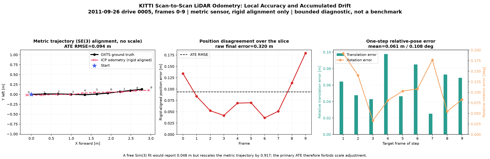
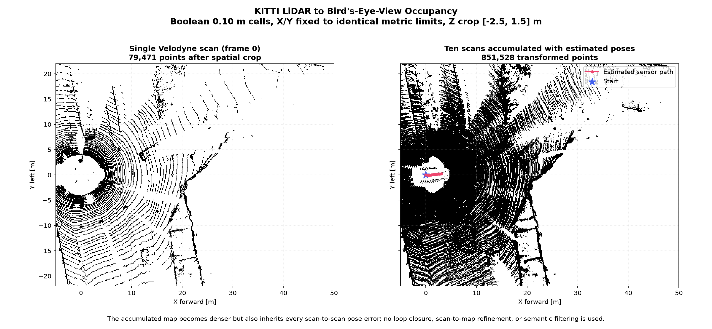

# KITTI LiDAR Odometry, Trajectory Error, and BEV

**Story position:** Stage 7. This closes the classical 3D sensor story after image-based sparse SfM and RGB-D registration. See [the complete 3D vision story](3d_vision_story.md).

## What this stage demonstrates

The bounded KITTI path answers three connected questions:

1. Can consecutive metric LiDAR scans be registered into relative motion?
2. What happens when those local motions are composed into a trajectory?
3. Can the same registered point clouds produce an interpretable bird's-eye-view occupancy map?

The implementation intentionally remains a transparent scan-to-scan baseline. It is useful precisely because its drift is visible and explainable; it is not presented as a modern production odometry system.

## Data and coordinate contract

The diagnostic uses KITTI raw sequence `2011_09_26_drive_0005_sync`, frames 0–9.

- Velodyne points are loaded from KITTI `.bin` files as `(x, y, z)` metres.
- KITTI Velodyne axes are `X forward`, `Y left`, `Z up`.
- Estimated pose `P_k` maps points from scan `k` into the scan-0 frame.
- `P_0 = I`.
- OXTS IMU poses are converted to Velodyne poses using the supplied calibration and normalized into the same initial frame.

For every consecutive pair, Open3D ICP estimates a transform from scan `k+1` to scan `k`. Global poses are composed as:

`P_(k+1) = P_k @ T_(k+1 to k)`.

This multiplication order matters. Reversing `T` or composing on the wrong side produces a plausible-looking but physically incorrect path.

## Processing pipeline

1. Load ten Velodyne scans and OXTS/calibration data with `pykitti`.
2. Voxel-downsample each scan at 0.20 m.
3. Register scan `k+1` to scan `k` with point-to-point ICP, a 1.0 m correspondence limit, and 50 iterations.
4. Reject non-finite or very-low-fitness registrations.
5. Compose the nine relative transforms into ten global poses.
6. Compare the path with normalized OXTS ground truth.
7. Transform the scans into frame 0 and rasterize boolean 0.10 m BEV occupancy.

## Metric policy and corrected interpretation

LiDAR measures distance in metres, so the primary trajectory metric must not be allowed to rescale the estimate. The curated result reports rigid-aligned ATE with scale fixed to one.

| Measurement | Result |
|---|---:|
| Frames | 10 |
| Raw position RMSE | 0.177 m |
| Rigid-aligned ATE RMSE, no scale | 0.094 m |
| Raw final position error | 0.320 m |
| Mean one-step translation error | 0.061 m |
| Mean one-step rotation error | 0.108 deg |
| Maximum one-step translation error | 0.098 m |
| Maximum one-step rotation error | 0.192 deg |

A previous project note quoted `0.048 m` ATE. That value came from a free Sim(3) alignment which scaled the estimated metric path by `0.917`. It remains useful as a diagnostic, but it is not the primary LiDAR claim because it hides an 8.3% scale discrepancy. The honest portfolio number is the `0.094 m` rigid-aligned ATE, alongside the raw and relative errors.



The trajectory figure shows three complementary views:

- rigid-aligned estimated and GT paths with no scale adjustment;
- per-frame position disagreement, exposing accumulated drift;
- one-step translation and rotation errors, exposing local registration quality.

ATE answers how far the whole trajectory disagrees after the stated global alignment. RPE answers how wrong each local motion increment is. A method can have reasonable RPE and still accumulate visible global drift.

## BEV occupancy

`bev(points, cell)` projects 3D points into boolean XY occupancy:

- rows correspond to the Y axis, with maximum Y at the top;
- columns correspond to X, increasing left to right;
- a cell is occupied if at least one retained 3D point falls inside it.

The curated artifact applies identical `X/Y` limits, a `Z` crop of `[-2.5, 1.5] m`, and 0.10 m cells to both panels.

| BEV measurement | Single scan | Ten-scan accumulated map |
|---|---:|---:|
| Cropped/transformed points | 79,471 | 851,528 |
| Occupied cells | 22,387 | 79,725 |



The single scan exposes the radial Velodyne sampling pattern and scene surfaces. Accumulating scans fills more cells and extends spatial coverage, but every pose error is also written into the map. Dense occupancy is therefore not proof of accurate registration.

## Reproduce

```bash
uv run pytest -q \
  tests/test_lidar_io.py tests/test_lidar_odometry.py \
  tests/test_trajectory.py tests/test_voxelize.py \
  tests/test_evaluate_kitti_lidar.py

uv run python scripts/evaluate_kitti_lidar.py \
  --kitti-root data/raw/kitti \
  --frames 10 \
  --voxel 0.2 \
  --max-correspondence-distance 1.0 \
  --max-iters 50 \
  --output-dir figures/curated
```

Outputs:

- `figures/curated/kitti_lidar_odometry.png`;
- `figures/curated/kitti_lidar_bev.png`;
- `figures/curated/kitti_lidar_metrics.json`;
- `figures/curated/kitti_lidar_trajectory.npz`.

Raw KITTI data is not committed.

## What the baseline does not solve

- Point-to-point ICP uses no surface normals or learned features.
- Identity initialization assumes small consecutive motion.
- Scan-to-scan matching does not use a persistent local map.
- There is no loop closure or global pose-graph optimization.
- Dynamic objects are not removed.
- Ground, vegetation, and distant returns are not weighted differently.
- A ten-frame raw slice cannot establish full-sequence or benchmark performance.
- BEV is boolean occupancy only; it does not encode height, density, intensity, semantics, or uncertainty.

The most meaningful classical extension would be a longer sequence with scan-to-map registration and pose-graph refinement. It is optional for the current portfolio because the bounded baseline already demonstrates sensing, registration, transform composition, metric evaluation, drift, and spatial rasterization.

## Interview Q&A

**Why register scan `k+1` to scan `k`?**  
It returns a transform that expresses the newer scan in the previous scan's coordinates. Composing that transform with the previous global pose places the new scan in the scan-0 map frame.

**Why does scan-to-scan odometry drift?**  
Every relative transform contains translation and rotation error. Composition multiplies those errors through time, and there is no global constraint that revisits earlier poses.

**What is the difference between ATE and RPE?**  
ATE measures global trajectory disagreement after an explicitly stated alignment. RPE compares relative motion over a selected frame gap and reflects local odometry quality.

**Why must LiDAR ATE avoid free scale?**  
LiDAR is already metric. Allowing a similarity alignment to rescale the estimated trajectory can hide a scale error that the sensor and algorithm should preserve.

**Why voxel-downsample before ICP?**  
It reduces runtime and partially equalizes nonuniform point density. The voxel size trades detail for speed and registration stability.

**What does the ICP correspondence threshold control?**  
It defines the convergence basin and which nearest-neighbour pairs contribute. Too small rejects correct pairs before alignment; too large admits unrelated geometry and moving objects.

**Why can a BEV map look dense even if odometry is wrong?**  
Occupancy only records whether transformed points land in cells. Small pose errors can smear surfaces while still increasing occupied-cell count, so a dense map needs trajectory or map-quality validation.

**How would you improve this baseline?**  
Use a motion-model initialization, point-to-plane or generalized ICP, ground/dynamic filtering, scan-to-submap registration, and pose-graph optimization with loop closure, then evaluate full-sequence drift under a fixed alignment policy.
