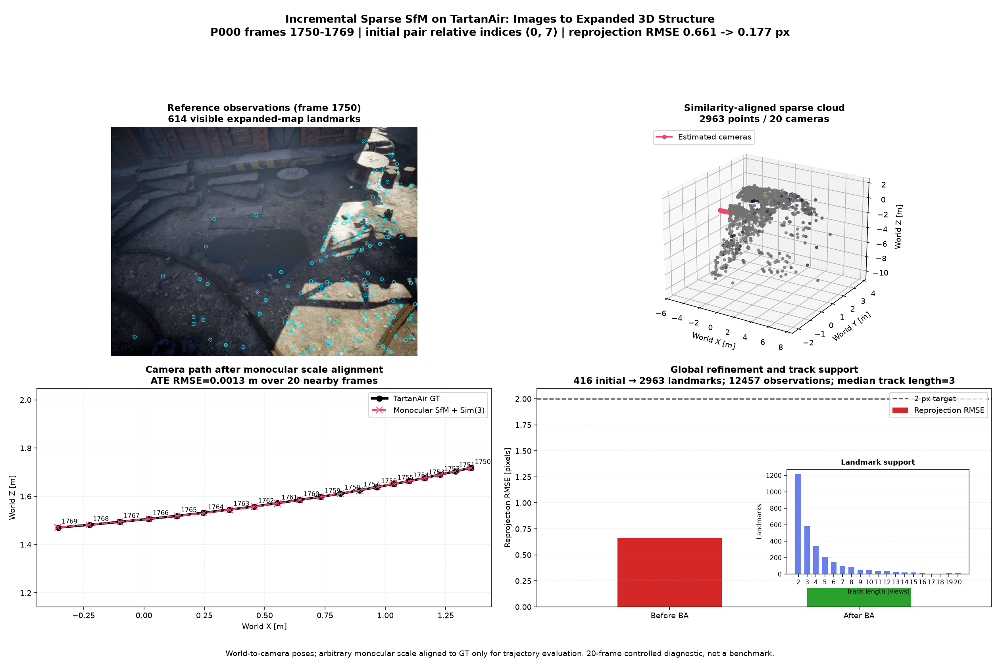

# Incremental Sparse Structure from Motion

**Story position:** Stage 5. This is the integration point where feature matching, robust two-view geometry, triangulation, PnP, and bundle adjustment become one reconstruction system. See [the complete 3D vision story](3d_vision_story.md).

## What the module computes

Given a calibrated, ordered image directory, `run_sfm_detailed(...)` estimates:

- a sparse set of scene points with shape `(N, 3)`;
- registered camera poses with shape `(M, 4, 4)`;
- an observation table `[camera_id, point_id, u, v]`;
- image/frame bookkeeping, track lengths, triangulation sources, per-landmark confidence,
  and reprojection metrics.

Every returned pose is **world to camera**:

`X_camera = R X_world + t`.

The camera centre in world coordinates is therefore `-R^T t`. The first camera defines the world frame. Essential-matrix geometry recovers only translation direction, so the initial translation is normalized to unit length and the entire reconstruction has arbitrary monocular scale.

## Why this stage matters

The earlier modules answer isolated questions: whether two points match, whether one epipolar geometry explains them, and where a point lies given two cameras. SfM asks whether those answers remain mutually consistent across several images.

That exposes the system-level problems hidden by unit tests:

- choosing an initial pair with enough baseline but still-matchable appearance;
- maintaining the identity of a landmark across images;
- estimating a new camera from existing 3D-to-2D correspondences;
- keeping pose directions and coordinate frames consistent;
- refining local estimates into one global explanation of the observed pixels.

## Implemented pipeline

### 1. Bounded image selection

Images are sorted and sliced with `start`, `stride`, and `max_images`. This keeps diagnostics deterministic and prevents an educational integration from silently becoming an unbounded reconstruction job.

### 2. Initial-pair selection

The first selected image is matched against every later candidate using the reusable SIFT/ORB matcher. Each candidate then passes through fundamental-matrix RANSAC, essential-matrix decomposition, cheirality selection, and DLT triangulation.

Candidates must produce enough finite, positive-depth points with low two-view reprojection error. The current score multiplies the valid landmark count by median pixel displacement. It is a practical heuristic, not a proof of geometric baseline: rotation can also create pixel displacement.

### 3. Initial landmark map

The selected pair defines the initial coordinate system:

- camera 0: `[I | 0]`;
- camera 1: `[R | t]`, with `||t|| = 1`;
- points: cheirality-valid DLT triangulations;
- tracks: the two pixel observations associated with every point.

### 4. Registering additional cameras

Each remaining image tries nearby registered views as anchors. RANSAC removes pairwise
geometric outliers. A nearest-neighbour lookup in anchor-pixel space associates matches with
known landmark IDs, using a small pixel tolerance and one observation per landmark.

OpenCV `solvePnPRansac` estimates the world-to-camera pose from these 3D-to-2D correspondences. An LM refinement improves the PnP inliers, and cameras with too few positive-depth points are rejected.

### 5. Expanding the landmark map

After PnP fixes the new camera pose, unmatched geometrically verified features between the
anchor and new view become candidate landmarks. Candidates pass positive-depth,
triangulation-angle, duplicate-pixel, finite-value, and reprojection-error gates. Accepted
points receive observations in both views and can support later PnP registrations.

The implementation records each point's triangulation pair and computes an interpretable
confidence proxy from track support and mean reprojection error. This is not calibrated
probability; it is an auditable signal for later geometry-quality experiments.

### 6. Global bundle adjustment

All registered poses, initial landmarks, and accepted observations are passed to sparse bundle adjustment. The first pose and one point-depth value fix the global similarity gauge. The result minimizes one coherent reprojection objective rather than leaving independently estimated camera poses disconnected.

## Current controlled-scene evidence

The curated TartanAir diagnostic uses `abandonedfactory/Easy/P000`, frames 1750–1769, with the documented approximate intrinsics `fx=fy=320, cx=320, cy=240`.

| Measurement | Result |
|---|---:|
| Requested / registered frames | 20 / 20 |
| Initial pair | relative frames 0 and 7 |
| Initial / expanded landmarks | 416 / 2,963 |
| Pixel observations | 12,457 |
| Median track length | 3 views |
| Reprojection RMSE before BA | 0.661 px |
| Reprojection RMSE after BA | 0.177 px |
| Short-path Sim(3)-aligned ATE RMSE | 0.0013 m |

The ATE number is reported only as a 20-nearby-frame integration check. Monocular centres are similarity-aligned to ground truth, and such a short smooth path can be fit very closely; this is not an odometry benchmark or evidence of long-term drift performance. The defensible headline is map expansion plus reprojection consistency, not the aligned ATE.



The figure was visually checked for coherent reference observations, a finite coloured sparse cloud, ordered camera motion matching the local GT direction, and a clearly visible reprojection-error reduction. The machine-readable reconstruction and metrics are saved beside the figure.

## Reproduce

```bash
uv run pytest -q tests/test_sfm_toy.py
uv run python scripts/make_figures.py \
  --figures tartanair-sfm \
  --output-dir figures/curated \
  --tartanair-frame 1750 \
  --tartanair-sfm-stride 1 \
  --tartanair-sfm-frames 20
```

Outputs:

- `figures/curated/tartanair_sparse_sfm.png`;
- `figures/curated/tartanair_sparse_sfm_metrics.json`;
- `figures/curated/tartanair_sparse_sfm_reconstruction.npz` containing points, poses,
  observations, frame indices, track lengths, triangulation sources, confidence, and
  intrinsics.

## Honest limitations

This is a minimal, controlled integration—not a production SfM engine.

- Track association uses per-anchor pixel proximity because the current matcher exposes
  coordinates rather than stable descriptor/keypoint IDs.
- One shared calibration is assumed and distortion is ignored.
- The initial-pair score uses image displacement rather than a direct triangulation-angle or uncertainty metric.
- There is no loop closure, relocalization, covisibility graph, keyframe policy, or long-sequence drift control.
- PnP tries multiple registered anchors, but a view is still skipped if none produces enough
  valid 3D-to-2D support.
- The current failure regression uses featureless images and verifies a clear initialization error. Low-baseline and repeated-texture sensitivity deserve a future visual only if it improves the portfolio story.

These are reasons to compare against COLMAP later, not reasons to replace this transparent integration with a large wrapper now.

## Failure modes to understand

- **No texture:** too few keypoints or matches, so no initial geometry exists. The test suite verifies this fails explicitly.
- **Pure rotation or tiny baseline:** valid matches may exist, but triangulated depth is poorly conditioned.
- **Repeated texture:** locally plausible descriptors can create incorrect landmark identity.
- **Dynamic objects:** one rigid epipolar model cannot explain independently moving points.
- **Wrong intrinsics:** corrupt essential pose, triangulation, PnP, and BA together.
- **Track corruption:** BA may reduce an aggregate robust loss while moving geometry toward a wrong local solution.
- **Scale confusion:** aligned metric trajectory plots do not make a monocular reconstruction metric.

## Interview Q&A

**Why initialize from two views instead of estimating every camera independently?**  
Two views establish a shared coordinate frame and triangulate landmarks. Those landmarks turn later pose estimation into a 3D-to-2D PnP problem, so all cameras are attached to the same map.

**Why use PnP for later views?**  
The initial map already provides 3D points. PnP estimates one camera pose from their 2D observations, while RANSAC rejects incorrect 2D-to-3D associations.

**Why is monocular scale arbitrary?**  
Scaling every translation and 3D point by the same factor leaves normalized image projections unchanged. Images alone determine structure only up to a global similarity transform without an external metric cue.

**What does bundle adjustment add after PnP?**  
PnP estimates cameras separately using fixed, noisy points. BA jointly adjusts all cameras and points so every retained observation is explained by one global reconstruction.

**Why is low reprojection error not sufficient proof?**  
A short or degenerate reconstruction, wrong calibration, corrupted tracks, or an overfit similarity alignment can still look numerically strong. Positive depth, track support, scene structure, camera path, ground truth where available, and failure cases must be checked too.

**Why expand landmarks after PnP rather than before?**  
Triangulation needs two known camera matrices. PnP first attaches the new view to the existing
map; only then can unmatched two-view tracks be triangulated into that world frame.

**What would you improve first for a larger sequence?**  
Expose stable descriptor IDs, merge multi-view tracks rather than relying on pixel proximity,
use keyframes/local BA, add relocalization, and compare completeness and trajectory against
COLMAP.
